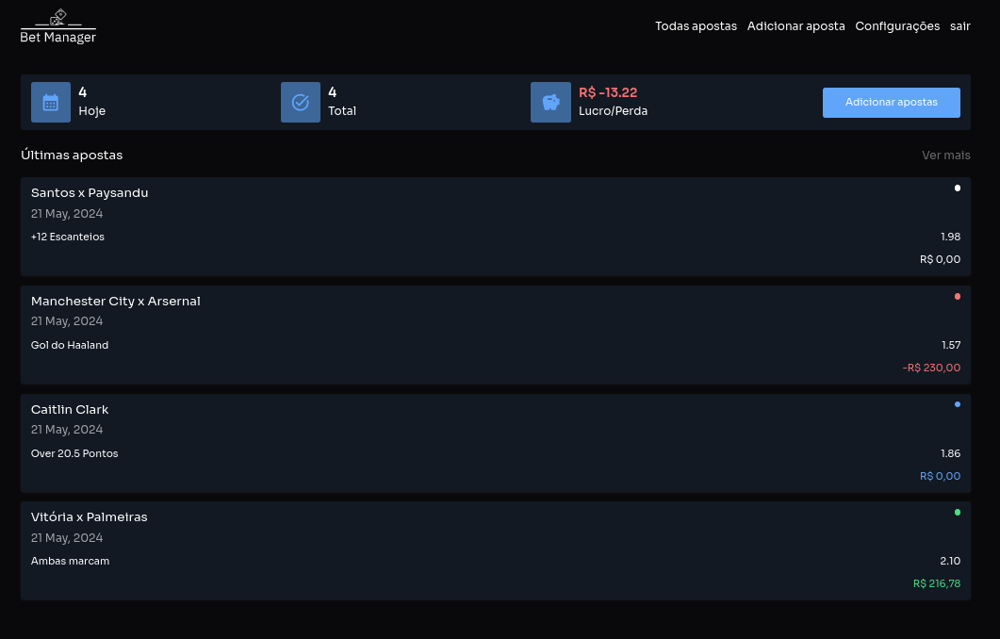

# Bet Manager

Um gerenciador de entradas para apostadores esportivo,
onde você pode substituir sua planilha excel por um sistema online de fácil utilização.

##

## Funcionalidades

- Autenticação com e-mail e senha
- Criar, Editar, Vizualizar e deletar uma aposta
- Métrica de quantidade de apostas realizadas
- Métrica de quantidades de apostas realizada no dia
- Métrica de lucro/perda prejuizo (A partir de todas apostas relizadas)
- Filtrar apostas por status (Red, Green, Pedding e Void)
- Filtrar apostas por data (7 dias, 14 dias, 30 dias e 90 dias)

## Melhorias

- [ ]  Testes unitários
- [ ]  Adicionar gráficos com desepenho nas apostas
- [ ]  Criação de uma timeline para apostas públicas

## Stack utilizada

A aplicação foi desenvolvida utilizando laravel + Livewire, sendo assim uma aplicação monolítica.

**Front-end:** Blade, Livewire, TailwindCSS

**Back-end:** PHP, Laravel, Docker,Eloquent, Cloudinary, PostgreSQL

